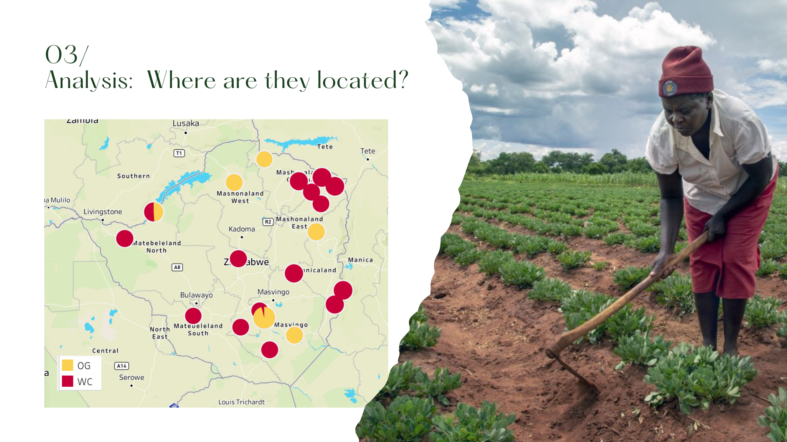

# Organic Farmers in Zimbabwe

 

## Overview
This project aims to analyze data related to farmers in Africa and product prices to gain insights into the agricultural sector's dynamics and economic trends. By examining the relationship between farmers, their products, and market prices, we can identify patterns and make informed decisions to support agricultural development and improve farmers' livelihoods.

## Data Sources
The data used in this analysis is sourced from the company's internal database, which includes records of farmer transactions, product quantities, prices, and additional relevant information. The dataset also incorporates supplementary data from agricultural surveys and market reports, providing a comprehensive understanding of the local farming ecosystem.

## Data Analysis Approach
We employed a combination of descriptive statistics, and data visualization to analyze the company's data. Key analysis methods include data cleaning, exploratory data analysis, and trend analysis. Python was used as the primary programming language, leveraging libraries such as pandas, and Matplotlib for data manipulation and analysis.

## Folder Structure
- `data`: Contains the raw and processed datasets used in the analysis.
- `notebooks`: Contains Jupyter notebooks with detailed explanations of the analysis steps and results.
- `sql`:Includes Python scripts used for data cleaning and analysis
- `tableau`: Includes dashboards.

## Results and Visualizations
### The analysis revealed several important insights:
#### - Products and variations in sales:

#### - Geographic patterns of farmer demographics:

#### - Variations in product prices and their impact on farmers' income:

## Tech Stack
* SQL
* Tableau
* Figma
* Python (pandas, matplotlib)
